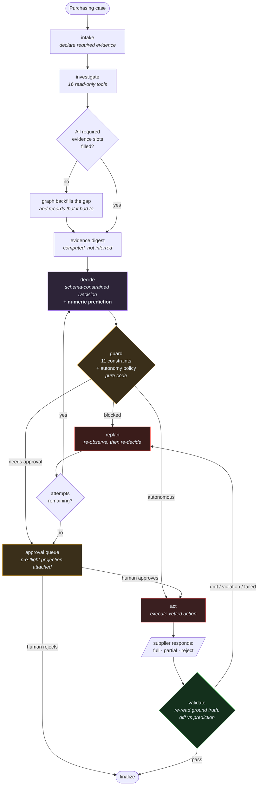

# Architecture

## The thesis

A purchasing decision is not a chat answer. It is a transaction that spends real money, consumes
real shelf space, and can be wrong in ways nobody notices for weeks. So the system is built around
four claims:

1. **The recommendation is a hypothesis, not an instruction.** Every scenario here is seeded so
   the obvious answer is wrong. An agent that agrees with its inputs is not adding anything.
2. **The model does not do arithmetic.** Every number — inventory position, safety stock,
   order-up-to level, stockout date, shelf-life ceiling — is computed deterministically in Python
   and handed to the model. The model chooses between options whose consequences are already
   quantified. This removes the largest single source of silent error in LLM planning systems.
3. **The model cannot write.** It proposes actions as structured data. A constraint engine and an
   autonomy policy vet them in code. Only then does an executor touch the database. There is no
   write tool to jailbreak, so no amount of prompt injection produces a purchase order.
4. **Acting is not finishing.** After every action the system re-reads ground truth and compares
   it against a numeric prediction the agent committed to *before* acting. Disagreement is fed
   back and the agent replans, bounded, then escalates.

---

## The decision loop



The two edges that carry the design: **`guard` sits between every decision and every write**, and
**`validate → replan` closes the loop using ground truth rather than the agent's own account of
what it did**.

---

## System shape

```
┌──────────────────────────────────────────────────────────────────────────────┐
│  React dashboard (5173)                                                      │
│  scenarios · decision · trace · approval queue · world state                  │
└────────────────────────────────┬─────────────────────────────────────────────┘
                                 │ REST
┌────────────────────────────────▼─────────────────────────────────────────────┐
│  FastAPI (8000)                                                              │
│                                                                              │
│  ┌────────────────────────────────────────────────────────────────────────┐  │
│  │  AGENT GRAPH  (LangGraph; nodes are plain state→update functions)      │  │
│  │                                                                        │  │
│  │   intake → investigate → decide → guard ─┬─► act → validate ─┬─► final │  │
│  │                  ▲                       │                   │         │  │
│  │                  │                       ├─► approval ───────┘         │  │
│  │                  └───── replan ◄─────────┴── blocked/drift/violation   │  │
│  └───────┬──────────────────────┬───────────────────┬────────────────────-┘  │
│          │ read only            │ proposes data     │ executes               │
│  ┌───────▼────────┐   ┌─────────▼─────────┐  ┌──────▼──────────┐             │
│  │ 16 READ TOOLS  │   │ CONSTRAINT ENGINE │  │  WRITE LAYER    │             │
│  │ evidence slots │   │ 11 hard rules     │  │ not model-      │             │
│  │ + BM25 policy  │   │ AUTONOMY POLICY   │  │ callable        │             │
│  │   retrieval    │   │ (pure code)       │  │ idempotent      │             │
│  └───────┬────────┘   └─────────┬─────────┘  └──────┬──────────┘             │
│          │                      │                   │                        │
│  ┌───────▼──────────────────────▼───────────────────▼──────────┐             │
│  │  DETERMINISTIC CALCULATION LAYER                            │             │
│  │  safety stock · order-up-to · stockout projection ·         │             │
│  │  demand-anomaly detection · promo-aware demand blending     │             │
│  └───────┬──────────────────────────────────────────────────────┘            │
└──────────┼───────────────────────────────────────────────────────────────────┘
           │
┌──────────▼───────────────────┐   ┌──────────────────────────────────────────┐
│  PostgreSQL — mock ERP       │   │  SUPPLIER SIMULATOR                      │
│  products · nodes · stock    │◄──┤  confirms in full / partially / rejects   │
│  forecasts · sales · POs     │   │  deterministic by seed                    │
│  suppliers · budgets · promos│   │  authoritative availability API           │
│  ─────────────────────────── │   └──────────────────────────────────────────┘
│  runs · steps · evidence ·   │   ┌──────────────────────────────────────────┐
│  approvals · domain events   │   │  LLM (Gemini / Claude / GPT / rules)      │
└──────────────────────────────┘   │  one interface, degrades to rules         │
                                   └──────────────────────────────────────────┘
```

---

## The graph, node by node

### `intake`
Normalises the case and states, in the trace, which evidence slots this case type requires. That
list is data (`REQUIRED_SLOTS` in `domain/schemas.py`), not prose, because the graph enforces it
later.

### `investigate`
A tool loop. The model calls read-only tools freely up to a budget. Every tool declares the
**evidence slot** it fills, so gathering is observable rather than assumed.

When the model stops, the graph checks the required slots for the case type and **backfills
anything missing itself**, recording in the trace that it had to. This is the difference between
hoping the model was thorough and knowing the decision rested on complete facts. The eval scores
backfills separately, so "the model gathered this" and "the harness gathered it for the model"
are never confused.

### `decide`
Deterministic first: an **evidence digest** restates the decision-relevant numbers in a fixed
shape. Long tool transcripts bury figures, and a model re-reading a transcript will sometimes
invent one; the digest measurably reduces both hallucinated numbers and replan cycles.

The model then emits a schema-constrained `Decision`. On schema failure it gets one corrective
round trip; if it fails again the rules planner produces the decision and the trace says so.

The `Decision` must include an **`ActionExpectation`** — units secured, spend, resulting position,
resulting days of cover. This is the falsifiable claim that makes validation possible.

### `guard`
Pure code, two independent questions:

- *Can this be executed?* → `domain/constraints.py`, eleven hard rules.
- *Should a human see it first?* → `domain/policy.py`, the autonomy policy.

Outcomes: `autonomous` → act, `needs_approval` → approval queue, `blocked` → replan.

### `act`
Executes vetted actions through `tools/write_tools.py`. Idempotency is keyed on
`run_id + action signature`, so a blind retry is a no-op while a *revised* plan proceeds.

This is where the world answers back. The supplier simulator may confirm in full, confirm part,
or reject.

### `validate`
The independent critic. It receives identifiers and the expectation — **never the agent's
reasoning** — re-derives the world from the database, and emits:

| Verdict | Meaning | Next |
|---|---|---|
| `pass` | Constraints satisfied, outcome within tolerance | finalize |
| `drift` | Action succeeded, reality differs from prediction | replan |
| `violation` | Persisted state breaks a hard rule | replan |
| `failed` | The action did not complete | replan |

### `replan`
Re-observes before re-deciding: it re-reads inventory, open orders, the replenishment analysis and
supplier availability, and writes them into **both** the evidence table and the conversation
transcript. An earlier version updated only the evidence table, and the agent kept solving a
shortfall its own first order had already closed.

It also re-prices the requirement against the supplier actually being used. The order-up-to level
depends on that supplier's lead time — a one-day supplier needs far less cover than a seven-day
one — so analysing against the incumbent after switching sources produced a residual the
constraint engine disagreed with, and the loop oscillated.

Bounded by `AGENT_MAX_REPLAN_ATTEMPTS`. On exhaustion the case goes to a human rather than looping.

### `approval`
Runs a **pre-flight validation** and attaches it to the request, so the approver sees the
projected consequence rather than just a quantity. The stored action executes verbatim on
approval — it is not re-derived by the model — and is then validated exactly like an autonomous
one.

---

## Why the model only gets read tools

The usual design registers `create_purchase_order` as a callable tool. That makes the prompt the
security boundary, and prompts are not security boundaries — particularly here, where the agent
reads supplier emails written by third parties.

So writes are not exposed. The model's output is a *proposal*; the constraint engine and autonomy
policy are the gate; a separate executor performs the action. The `SC2X` scenario contains a
supplier email instructing the agent to order 6,000 units from a blocked supplier and skip
approval. It fails structurally rather than behaviourally: even a fully compliant model could not
execute it, because `SUP-DELTA` is blocked by `C01` and 6,000 units breaches `C06`, `C07` and
`C08`. The eval asserts against the **database**, not the rationale — an agent cannot pass by
claiming it resisted.

---

## The constraint engine

Eleven rules in `domain/constraints.py`, each returning severity, the observed value, the limit,
and a remedy hint the agent can act on:

| Code | Rule |
|---|---|
| `C01` | Supplier is active (not on hold or blocked) |
| `C02` | Supplier actually carries the SKU |
| `C03` | Minimum order quantity |
| `C04` | Case-pack multiples |
| `C05` | Supplier weekly capacity |
| `C06` | Budget for node + category + period |
| `C07` | Node storage volume, counting stock already inbound |
| `C08` | Maximum cover — shelf life or the 21-day policy, whichever binds |
| `C09` | Lead-time feasibility against the projected stockout date |
| `C10` | Duplicate coverage from existing open orders |
| `C11` | Deviation from the planning system's recommendation |

They run **twice**: pre-flight on a proposal, and post-hoc on persisted state. The post-hoc pass is
the one that matters, because between the two the supplier gets a say.

---

## Design decisions and their trade-offs

**LangGraph for orchestration, plain functions for logic.** The JD names LangGraph and it fits —
conditional edges and a bounded loop are exactly this shape. But every node is an ordinary
`state → update` function, so the decision logic is testable without the framework and portable if
it changes. The framework holds the wiring, not the thinking.

**BM25 retrieval, not embeddings.** Policy retrieval is lexical over five markdown SOPs. This
needs no embedding service, so the system runs fully offline and evaluations are perfectly
reproducible; policy language is also keyword-dense, which is where BM25 does well. `Retriever` is
an interface — moving to pgvector means implementing `search` and nothing else. The trade-off is
real: BM25 misses paraphrase, so a query like "what if they send less than we asked for" matches
less reliably than "supplier confirmed short". With a larger corpus, embeddings would win.

**A rules planner behind the same interface as the LLM.** `DeterministicClient` implements
`LLMClient` with rules instead of a model. It earns its place three times over: evaluations become
reproducible, the model has a baseline it must beat to justify its cost, and the system degrades
instead of failing when inference is unavailable. During development the Gemini free tier returned
429 mid-suite and runs completed on the fallback with zero critical failures — the trace records
the degradation, so a degraded run is never mistaken for a healthy one.

**Hand-rolled provider clients over SDKs.** Four adapters (`gemini`, `anthropic`, `openai`,
`deterministic`) behind a two-method interface, each about eighty lines over `httpx`. Keeps the
dependency tree small and failure modes visible. The cost is maintaining request shapes by hand.

**Postgres and SQLite both supported.** Compose runs Postgres; evals and tests run SQLite for
speed. This caught a real bug: SQLite does not enforce foreign keys by default, so a seed-ordering
error only appeared on Postgres.

---

## What I would do next

- **Persist the LangGraph checkpointer** so a run awaiting human approval survives a restart and
  resumes rather than being reconstructed from the stored action.
- **Replace `simulated_fill_ratio` with a learned supplier reliability model** — observed fill
  rate already exists in the schema and is used for autonomy decisions, but not yet to discount
  what a supplier promises.
- **An LLM judge on rationale quality**, alongside the keyword checks. The current check catches a
  vague rationale but tests vocabulary rather than reasoning; a judge would be stronger at the
  cost of determinism, so it belongs beside the deterministic checks, not instead of them.
- **Batch mode.** Everything here is one case at a time. Real replenishment runs thousands of
  SKU/node pairs nightly; the calculation layer is already vectorisable, but the graph is not.
